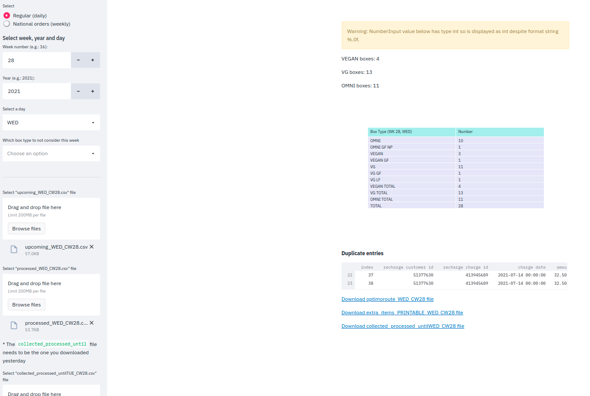
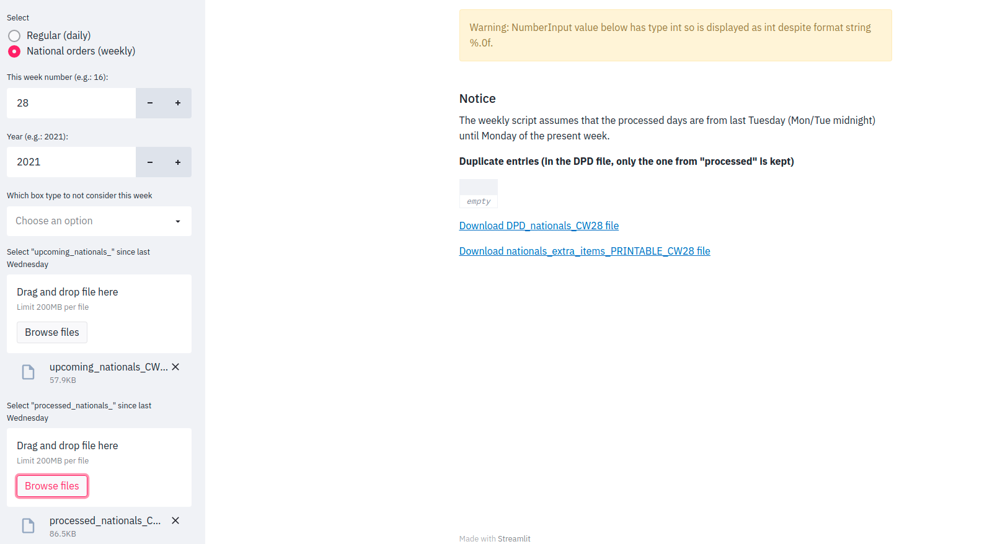

Documentation

## Fulfillment App Documentation

**Author:** Ondrej Zika
**Date:** 16.7.2021

---

This document contains information about the use of the Good Bank's "Fulfillment App". The app is designed to process raw input from Recharge and generate files compatible with Optimoroute route planner (Daily planning) and DPD shipping system (National orders).
Additionally, the system generates overview of extra items ordered (incl. "printable" version), duplicate entries, processed orders on previous days as well as a graphical breakdown of box types and their amounts.

**Important:** The scripts are tailored to the specific naming conventions of the Recharge system on Shopify. Changes to naming of columns and content will likely result in incorrect behaviour. Any such changes should be flagged to the current maintainer of the system.

---

App is currently (temporarily) hosted here: [https://share.streamlit.io/ozika/good_bank/streamlit_dev/fulfillment_app.py](https://share.streamlit.io/ozika/good_bank/streamlit_dev/fulfillment_app.py)

#### a. Daily Planning

##### Interface

##### Overview

**Input:**
`Week Number`
`Year`
`Day`
`Box type exclusion` - some weeks don't have pork (NP), glutenfrei (GF) or laktosefrei (LF), this can be indicated so that labels don't include redundant information
`Processed` - contains new orders
`Upcoming` - contains recurring orders
for WED-FRI additionally `Collected Processed Untill Previous Day` - contains all orders (new & recurring) for the cuurent week up till yesterday

**Naming convention of files (not strict):**
Processed: `processed_<DAY>_CW<WEEK NUMBER>.csv`
Upcoming: `upcoming_<DAY>_CW<WEEK NUMBER>.csv`
Collected Processed Untill Previous Day: `collected_processed_until<PREVIOUS DAY>_CW<WEEK NUMBER>.csv`

**Output**
- count of box types, broken down by box type
- duplicates (just for a quick check, if the same order occurs in both processed and upcoming then the system **keeps both** and one needs to be removed manually, this can be easily adjusted to only keep one by changing the input parameter `policy` to "keep_processed" - talk to dev if desired)
- `optimoroute_<DAY>_CW<WEEK NUMBER>.csv` file with all orders for current date
- `extra_items_PRINTABLE_<DAY>_CW<WEEK NUMBER>.csv` file which is overview of extra items for today
- `collected_processed_until<DAY>_CW<WEEK NUMBER>.csv` all orders processed for this week until today, necessary for upcoming days

##### Under the hood
**Processed**
- identify current date
- load processed file
- filter column `charge type` for `Subscription First Order` only
- check for `LOCAL DELIVERY` in `product title` column, if exists then merge the two lines of the same customer by moving `product title`, `variant title`, `line_item_properties` one up and deleting the remaining duplicate line
- remove orders for later days
- remove national orders
- on Wed-Fri use the `collected_processed_until...` to only keep new orders for today
- generate `collected_processed_until` for upcoming day
- rename box type (VEGGIE -> VG, add extra items count, etc)
- rename the following columns (they differ from the upcoming file):
"charged date" to "charge date"
"total amount" to "amount"
"line_item_properties" to "line item properties"

**Upcoming**
- load upcoming file
- on TUE take all orders since SAT (in case they show Monday as delivery date), on other days just take orders for today
- exclude national orders
- rename box type (VEGGIE -> VG, add extra items count, etc)

- merge upcoming and processed

**After merge**
- check for duplicates and produce report
- process extra items and generate report
- remove national extra items
- remove ignored type from label ("variant title")
- rename columns to match Optimoroute template
- if run locally (not streamlit) save all files, otherwise generate links and deploy on the website

---

#### b. National Orders

##### Interface

##### Overview
**Input**
`Week number`
`Year`
`Box type exclusion` - on some weeks the box planning does not require to identify no pork (NP), glutenfrei (GF) or laktosefrei (LF) boxes. The exclusion function allows to avoid redundant information
`Processed Nationals` - contains new orders
`Upcoming Nationals` - contains recurring orders

**Naming convention of files (not strict):**
Processed: `processed_nationals_CW<WEEK NUMBER>.csv`
Upcoming: `upcoming_nationals_CW<WEEK NUMBER>.csv`

**Output**
- `DPD` file with processed and fotmatted data
- `Extra items for Nationals` printable version
- duplicates (just for a quick check, if the same order occurs in both processed and upcoming then the system **keeps both** and one needs to be removed manually, this can be easily adjusted to only keep one by changing the input parameter `policy` to "keep_processed" - talk to dev if desired)

##### Under the hood
**Processed**
- load processed file
- filter column `charge type` for `Subscription First Order` only
- rename the following columns (they differ from the upcoming file):
"charged date" to "charge date"
"total amount" to "amount"
"line_item_properties" to "line item properties"

**Upcoming**
- load file

**After merge**
- rename box type (e.g VEGGIE -> VG; add extra items count, etc)
- process extra items and generate report
- remove extra items for local orders
- check for duplicates and report
- extract address and house number (the DPD master file requires house numbers in a separate column)
- create DPD file based on template
- rename box types for DPD labels (only VEGGIE/VEGAN/OMNIVORE)
